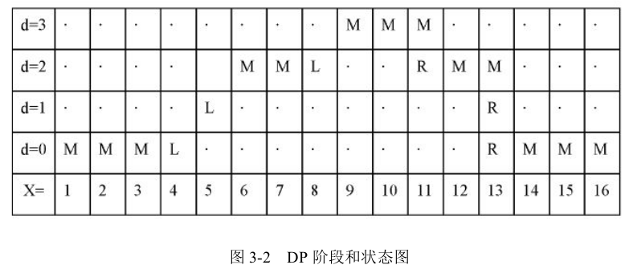

# 2018-4-16-StereoMatching

## 1.动态规划

### 传统的动态规划算法
- 动态规划立体匹配是基于极线约束，通过依次寻找每条极线上匹配点對的最小代价路径的动态寻优方法求解全局能量最小化，得到匹配视差图.算法分为以下几个步骤:
	- 阶段划分:由于通过极线校正的图像只能在水平方向上寻找扫描点，所以算法是在水平扫描的视差空间切面上寻找最优路径的过程，以像素点的行方向为横坐标，视差图$d$为纵坐标，依次将整个过程划分为$1,2...k$个阶段，把立体匹配划分成可以排序的若干个阶段.
	
	- 确定状态:将上述各个阶段所处的匹配阶段用不同的状态表示.每个阶段的状态就是对应像素点的匹配情况，共用三种状态:相互匹配记为$M$，左可见右遮挡为$L$,右遮挡为$R$，状态的选择满足无后效性.
	
	- 状态转移方程:所谓状态转移方程就是根据前一阶段的状态确定当前阶段的状态，根据顺序性的约束，允许的状态转移的形式共有七种(用小写字母表示前一阶段的状态，大写字母表示当前阶段的状态).如下图:
	
	- 求取最优解，记录该最优解下的路径:通过相测度函数计算像素状态间转换的代价，从左向右，或者自右向左计算最优值，并计算此时的最优路径.计算相似性测度函数与平滑函数的即视差空间的$D(p,P_d)+V(i,j)$的最小值，并记录取得最小值时的匹配路径.
	- 动态规划算法的实质是对于基于水平极线视差空间图像的每一行扫描，寻找一条使得全局能量函数最小的匹配.全局能量函数为
	 $$E(d)=E(data)+E(smooth)$$
	 其中$E(data)$为图像数据约束项，判断匹配像素点之间的相似性，$E(smooth)$为相邻点间的平滑约束项，判断相邻点之间连续性.数据项由匹配代价获得:
	 $$E(data)=m(p_{x,y},d)+\sum_{p\in I}C(p,d)$$
	 其中$m(p_{x,y},d)$表示在视差$d$的像素点$p$的代价函数.
	 $$E(smooth)=\sum_{(p,q)\in N}S(d_p,d_q)$$
	 其中$N$表示相邻像素对的集合，$d_p$,$d_q$分别表示像素点$p$与像素点$q$的视差，平滑项$s(d_p,d_q)$表示相邻像素点$p,q$之间的平滑约束，定义如下:
	 
	 其中$P_1,P_2,P_3$表示不同情况下的惩罚常量，$\Delta C_{p,q}$表示待匹配的像素点$p$与其相邻点$q$之间的色彩差异，当相邻点视差值相同时，惩罚量为零;差值为1时惩罚项为$P_1$，当差值大于1时且两个对应像素点的色彩差异小于阈值$T$时，惩罚量为$P_2$,否则惩罚量为$P_3$.
	- 传统动态规划算法是在保证匹配精度的同时计算时间短，是一种高效的全局算法，但缺点是匹配过程只在扫描线上寻经，忽略了扫描线间视差的约束，视差图有明显的条纹现象.